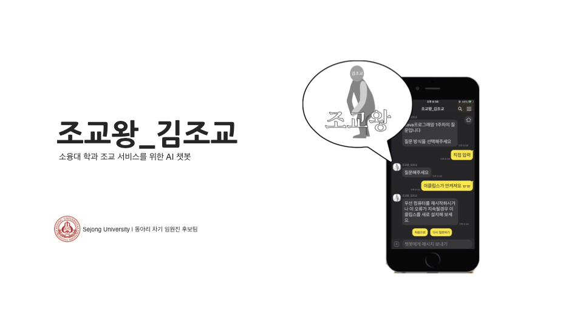

# 조교왕\_김조교

> 친근하고 익숙한 김조교가 여러분을 도와드립니다.

![version] ![license] ![support]

2019 세종대학교 제 7회 SW 인공지능 해커톤 (2019.12.26 ~ 2019.12.27) 장려상 수상  
소융대 학과 조교 서비스를 위한 AI 챗봇 주제  
조교의 질답 기능 보조 챗봇

## 서비스

~~카카오톡에서 "조교왕\_김조교" 검색~~  
해커톤 이후 서비스 종료

## 개발 환경

Develop with VS Code

Period : 19.12

[version]: https://img.shields.io/badge/version-v1.0-green
[license]: https://img.shields.io/badge/license-MIT-blue.svg
[support]: https://img.shields.io/badge/support-End-black
